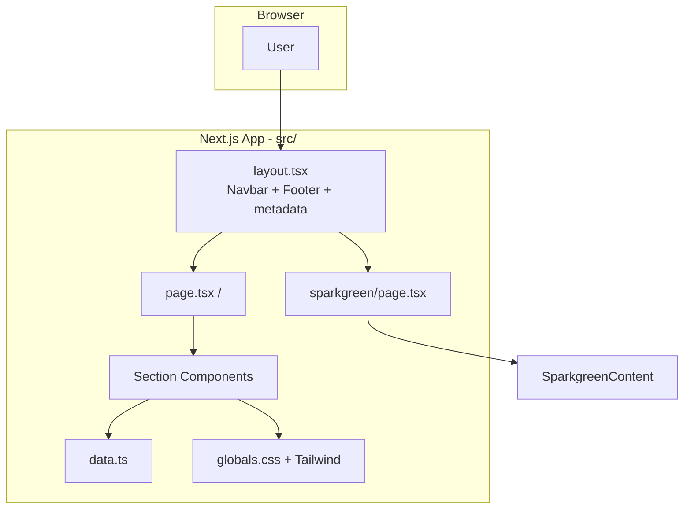
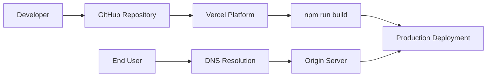
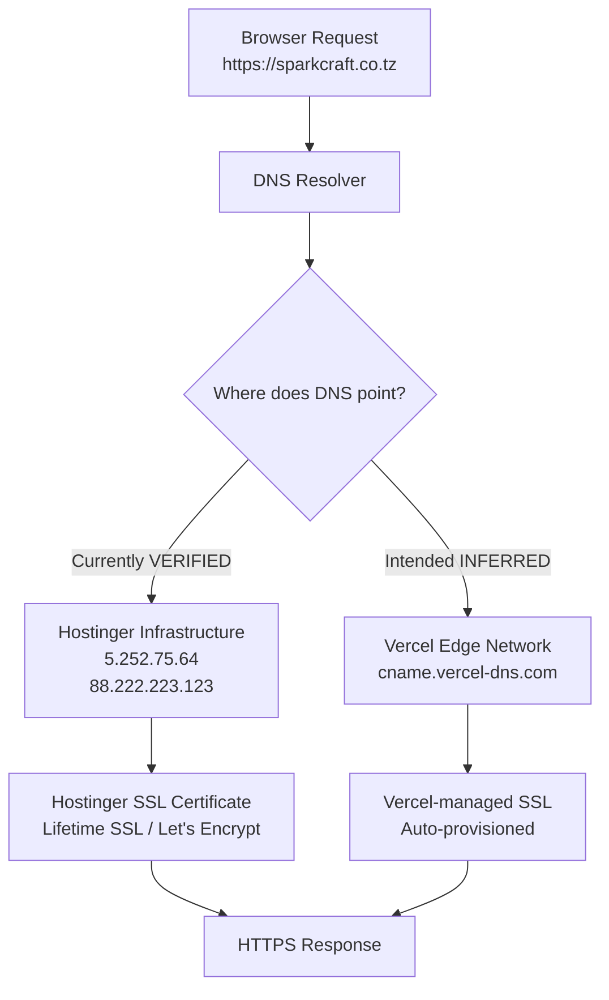

# SparkCraft Architecture

Last reviewed: August 2026

Evidence classifications used throughout: **VERIFIED**, **INFERRED**, **REQUIRES MANUAL VERIFICATION**.

---

## System Overview

SparkCraft is a **static marketing website** with no server-side API, database, or authentication. All pages are pre-rendered at build time (Static Site Generation).

| Characteristic | Value | Evidence |
|----------------|-------|----------|
| Rendering | Static (SSG) | VERIFIED — `next build` output shows `○ (Static)` |
| Backend | None | VERIFIED — no API routes in `src/app/` |
| Database | None | VERIFIED — no database client in dependencies |
| Authentication | None | VERIFIED — no auth code |
| CMS | None | VERIFIED — content in `src/lib/data.ts` and inline arrays |
| Environment variables | None in use | VERIFIED — no `process.env` references |

---

## Application Architecture



### Route Structure

| Route | File | Type | Sections |
|-------|------|------|----------|
| `/` | `src/app/page.tsx` | Static | Hero, Ticker, About, Services, Expertise, Who We Serve, Industries, BI Reports, CTA |
| `/sparkgreen` | `src/app/sparkgreen/page.tsx` | Static | 9 Sparkgreen sections via `SparkgreenContent.tsx` |
| `/_not-found` | Next.js built-in | Static | 404 page |

### Global Shell

`src/app/layout.tsx` wraps all routes with:

- Inter font (Google Fonts via `next/font`)
- Root SEO metadata
- `<Navbar />` (fixed header)
- Page content (`{children}`)
- `<Footer />` (site-wide footer)

### Component Hierarchy (Homepage)

```
page.tsx
├── Hero          (#hero implicit, dark background)
├── TickerStrip     (marquee)
├── About           (#about)
├── Services        (#services)
├── WhatMakesDifferent (#expertise)
├── WhoWeServe      (#who-we-serve)
├── Industries      (#sectors)
├── BIReports
└── CTA             (#contact)
```

### Data Flow

```
src/lib/data.ts  →  Section components  →  Rendered HTML
(inline arrays)  →  SparkgreenContent   →  Rendered HTML
```

No runtime data fetching. No external APIs.

---

## Deployment Architecture



### Verified Repository Configuration

| Setting | Value | Source |
|---------|-------|--------|
| Framework | Next.js | `vercel.json` |
| Build command | `npm run build` | `vercel.json`, `package.json` |
| Output directory | `.next` | `vercel.json` |
| Install command | `npm install` | `vercel.json` |
| Standalone output | Enabled | `next.config.js` |
| Image optimization | Enabled (default) | `next.config.js` |

### INFERRED (verify in Vercel Dashboard)

| Setting | Expected Value |
|---------|----------------|
| Production branch | `main` |
| Production domain | `sparkcraft.co.tz` |
| GitHub integration | `PHENOMVALENCE/sparkcraft` |
| Preview deployments | Enabled for PR branches |
| Node.js version | 18.x or 20.x (Vercel default) |

---

## Domain Architecture



### Role Separation

| Role | Provider | Evidence |
|------|----------|----------|
| **Source code host** | GitHub | VERIFIED — remote `origin` is `github.com/PHENOMVALENCE/sparkcraft` |
| **Deployment platform** | Vercel | VERIFIED — `vercel.json`; INFERRED from dashboard screenshot |
| **Domain registrar** | Hostinger (likely) | INFERRED — hPanel screenshot shows domain management |
| **DNS provider** | Hostinger | VERIFIED — SPF TXT includes `_spf.mail.hostinger.com`; www CNAME to `cdn.hstgr.net`; SOA `dns.hostinger.com` |
| **Application host (intended)** | Vercel | INFERRED — Vercel dashboard shows `sparkcraft.co.tz` as production domain |
| **Application host (current DNS)** | Hostinger | VERIFIED — A records resolve to Hostinger IPs (August 2026) |
| **SSL/TLS termination** | Whoever receives traffic | VERIFIED principle — currently Hostinger due to DNS |
| **Email host** | Hostinger | VERIFIED — SPF record |

---

## Legacy Architecture (Parallel Implementation)

The repository contains a **pre-Next.js static site** at the repository root:

| File | Purpose |
|------|---------|
| `index.html` | Static homepage (duplicate of `/`) |
| `sparkgreen.html` | Static Sparkgreen page (duplicate of `/sparkgreen`) |
| `style.css` | ~2000 lines of CSS for both brands |
| `script.js` | Ticker, mobile nav, FAQ accordion, scroll reveal |

These files are **not imported** by the Next.js application. They may be served if:

- Apache/XAMPP serves the directory directly (local development path `c:\xampp\htdocs\sparkcraft`)
- Hostinger static hosting serves the repository root

This creates a **dual-source risk**: content updates in Next.js components do not automatically update legacy HTML.

---

## Third-Party Services

| Service | Role | Integration | Env Vars |
|---------|------|-------------|----------|
| Google Fonts (Inter) | Typography | `next/font/google` in `layout.tsx` | None |
| Framer Motion | Scroll/enter animations | Client components | None |
| Lucide React | Icons | Components | None |
| Vercel | Hosting/deployment | `vercel.json` + dashboard | None in repo |
| Font Awesome CDN | Icons (legacy only) | `index.html`, `sparkgreen.html` | None |
| cdnjs.cloudflare.com | CDN (legacy only) | Font Awesome delivery | None |

**Not present:** Analytics, CRM, email API, CMS, payment, maps API, authentication.

---

## Security Architecture

- No server-side secrets (static site)
- No user input processing (contact via `mailto:` / `tel:` links)
- No `dangerouslySetInnerHTML` in React components
- No Content Security Policy headers configured
- No security headers in `next.config.js` or `vercel.json`

See [SECURITY.md](SECURITY.md) for full review.

---

## Build Output

Verified build output (August 2026):

| Route | Size | First Load JS |
|-------|------|---------------|
| `/` | 9.55 kB | 134 kB |
| `/sparkgreen` | 9.98 kB | 135 kB |
| `/_not-found` | 873 B | 88.1 kB |
| Shared JS | — | 87.3 kB |

All routes are statically pre-rendered.
