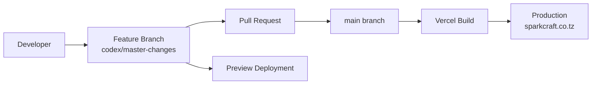

# SparkCraft Deployment Guide

Last reviewed: August 2026

---

## Deployment Pipeline



---

## Verified Repository Configuration

From `vercel.json`:

```json
{
  "framework": "nextjs",
  "buildCommand": "npm run build",
  "outputDirectory": ".next",
  "devCommand": "npm run dev",
  "installCommand": "npm install"
}
```

From `next.config.js`:

```javascript
{
  output: "standalone",
  images: { unoptimized: false }
}
```

From `package.json` scripts:

| Script | Command |
|--------|---------|
| Build | `next build` |
| Start | `next start` |
| Dev | `next dev` |
| Lint | `next lint` |

---

## Verify in Vercel Dashboard

The following settings must be confirmed in the Vercel project dashboard (not verifiable from repository code alone):

| Setting | Expected Value | Status |
|---------|----------------|--------|
| Project name | `sparkcraft` | INFERRED from screenshot |
| GitHub repository | `PHENOMVALENCE/sparkcraft` | INFERRED |
| Production branch | `main` | INFERRED |
| Production domain | `sparkcraft.co.tz` | INFERRED — shown as verified in dashboard |
| Framework preset | Next.js | VERIFIED via `vercel.json` |
| Node.js version | 18.x or 20.x | REQUIRES MANUAL VERIFICATION |
| Environment variables | None currently used | VERIFIED — no env vars in code |

---

## Production Deployments

Production deployments trigger automatically when changes are merged to `main`.

### Expected Flow

1. Developer creates feature branch from `main` (or `codex/master-changes`)
2. Changes are committed and pushed
3. Pull request opened targeting `main`
4. Vercel creates a preview deployment for the PR branch
5. PR is reviewed and merged to `main`
6. Vercel builds and deploys to production
7. Production domain `sparkcraft.co.tz` serves the new deployment

**Important:** For the production domain to serve the Vercel deployment, DNS must point to Vercel. As of August 2026 audit, DNS points to Hostinger. See [DOMAIN-DNS-SSL.md](DOMAIN-DNS-SSL.md).

---

## Preview Deployments

INFERRED from Vercel dashboard screenshot showing `codex/master-changes` branch with preview deployment linked to PR #1.

Preview deployments:

- Trigger on push to any non-production branch
- Receive a unique Vercel URL (e.g., `sparkcraft-xxx.vercel.app`)
- Do not affect production domain
- Useful for reviewing changes before merge

---

## Build Process

Verified build output:

```
▲ Next.js 14.2.35

Creating an optimized production build ...
✓ Compiled successfully
Linting and checking validity of types ...
Collecting page data ...
Generating static pages (5/5)
Finalizing page optimization ...
Collecting build traces ...

Route (app)                              Size     First Load JS
┌ ○ /                                    9.55 kB         134 kB
├ ○ /_not-found                          873 B          88.1 kB
└ ○ /sparkgreen                          9.98 kB         135 kB

○  (Static)  prerendered as static content
```

Build time: ~2 minutes on local machine (August 2026).

---

## Rollback

Vercel supports instant rollback to a previous deployment:

1. Open Vercel project dashboard → Deployments
2. Find the previous successful production deployment
3. Click "Instant Rollback" (visible in dashboard screenshot)

Rollback reverts the Vercel deployment but does not revert Git history.

---

## Environment Variables

No environment variables are currently used by the application.

If variables are added in the future, configure them in:

- **Vercel Dashboard** → Project Settings → Environment Variables
- Set separately for Production, Preview, and Development scopes

See [ENVIRONMENT.md](ENVIRONMENT.md).

---

## Post-Deployment Verification

After each production deployment, verify:

- [ ] Vercel deployment status is "Ready"
- [ ] Preview URL loads correctly
- [ ] Production domain loads (if DNS points to Vercel)
- [ ] HTTPS certificate is valid
- [ ] Homepage sections render correctly
- [ ] `/sparkgreen` page loads
- [ ] Navigation links work (anchor scrolling)
- [ ] Mobile navigation opens/closes
- [ ] Contact email/phone links work
- [ ] No console errors in browser DevTools

---

## Deployment Troubleshooting

| Problem | Likely Cause | Action |
|---------|-------------|--------|
| Build fails on Vercel | TypeScript/ESLint error | Run `npm run build` locally first |
| Deployment succeeds but domain shows old site | DNS points elsewhere | Check DNS records — see DOMAIN-DNS-SSL.md |
| SSL error after deployment | DNS not pointing to Vercel | Update DNS to Vercel |
| Preview works but production doesn't | DNS or domain config | Verify domain in Vercel dashboard |
| GitHub push doesn't trigger deploy | Webhook/integration issue | Check Vercel Git integration settings |

See [TROUBLESHOOTING.md](TROUBLESHOOTING.md) for detailed diagnostic procedures.
