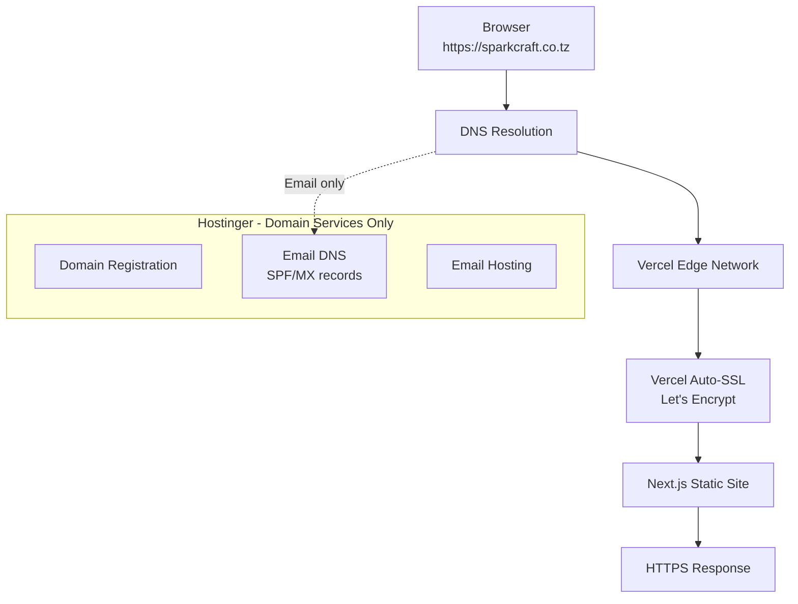
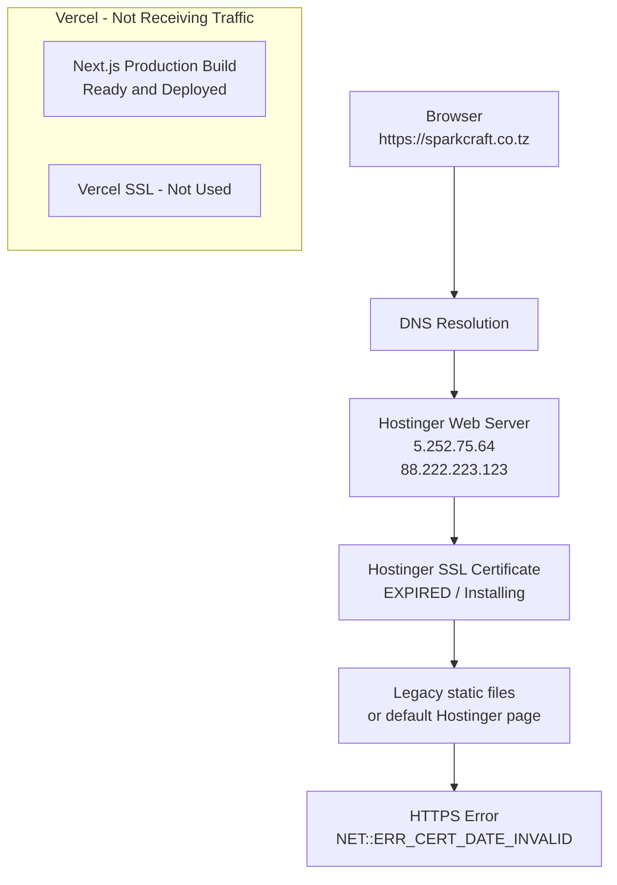

# Domain, DNS, and SSL — sparkcraft.co.tz

Last reviewed: August 2026

This is the most critical infrastructure document for resolving the production SSL incident.

---

## Domain Overview

| Property | Value | Evidence |
|----------|-------|----------|
| Production domain | `sparkcraft.co.tz` | VERIFIED — Vercel dashboard, user context |
| TLD | `.co.tz` (Tanzania) | VERIFIED |
| Alternate domain referenced in metadata | `sparkcraftconsulting.com` | VERIFIED — in `layout.tsx` OpenGraph URL (likely incorrect/stale) |

---

## Role Separation

Understanding who does what is essential for troubleshooting:

| Role | Provider | Evidence | Status |
|------|----------|----------|--------|
| **Domain registrar** | Hostinger (likely) | INFERRED — hPanel screenshot shows domain management for `sparkcraft.co.tz` | REQUIRES MANUAL VERIFICATION |
| **DNS provider** | Hostinger | VERIFIED — SOA record `dns.hostinger.com`; SPF TXT; www CNAME to `cdn.hstgr.net` | Active |
| **Application host (intended)** | Vercel | INFERRED — Vercel dashboard shows production domain | Configured |
| **Application host (current DNS target)** | Hostinger | VERIFIED — A records resolve to Hostinger IPs | **Misconfigured** |
| **Source code host** | GitHub | VERIFIED — `github.com/PHENOMVALENCE/sparkcraft` | Active |
| **Deployment platform** | Vercel | VERIFIED — `vercel.json`, dashboard screenshot | Active |
| **SSL/TLS termination (current)** | Hostinger | VERIFIED — traffic reaches Hostinger due to DNS | Expired/stale certificate |
| **SSL/TLS termination (intended)** | Vercel | INFERRED — auto-provisioned when DNS points to Vercel | Not active (DNS issue) |
| **Email host** | Hostinger | VERIFIED — SPF: `v=spf1 include:_spf.mail.hostinger.com ~all` | Active |

---

## DNS Records (Verified August 2026)

Query tool: Google Public DNS (`8.8.8.8`)

### A Records — sparkcraft.co.tz

| Type | Host | Value | Purpose | Managed By | Verified? |
|------|------|-------|---------|------------|-----------|
| A | `@` (sparkcraft.co.tz) | `5.252.75.64` | Web hosting | Hostinger | **YES** |
| A | `@` | `88.222.223.123` | Web hosting (secondary) | Hostinger | **YES** |
| AAAA | `@` | `2a02:4780:47:e888:...` | IPv6 hosting | Hostinger | **YES** |
| AAAA | `@` | `2a02:4780:46:78c7:...` | IPv6 hosting (secondary) | Hostinger | **YES** |

### CNAME Records

| Type | Host | Value | Purpose | Managed By | Verified? |
|------|------|-------|---------|------------|-----------|
| CNAME | `www` | `www.sparkcraft.co.tz.cdn.hstgr.net` | www subdomain → Hostinger CDN | Hostinger | **YES** |

### TXT Records

| Type | Host | Value | Purpose | Managed By | Verified? |
|------|------|-------|---------|------------|-----------|
| TXT | `@` | `v=spf1 include:_spf.mail.hostinger.com ~all` | Email SPF | Hostinger | **YES** |
| TXT | `@` | `google-site-verification=wUplxw1UjAHVBvyy01m-wdw0kki5C2fc5nFxaly_Cec` | Google Search Console | Google | **YES** |

### Records NOT Found (Expected for Vercel)

| Type | Host | Expected Value | Purpose | Verified? |
|------|------|----------------|---------|-----------|
| CNAME | `@` or `www` | `cname.vercel-dns.com` | Point domain to Vercel | **NOT PRESENT** |
| A | `@` | `76.76.21.21` (Vercel) | Alternative Vercel pointing | **NOT PRESENT** |

### REQUIRES MANUAL VERIFICATION

| Type | Host | Purpose | Where to Check |
|------|------|---------|----------------|
| MX | `@` | Email routing | Hostinger hPanel → Email → DNS |
| NS | `@` | Nameserver delegation | Hostinger hPanel → Domains |
| CAA | `@` | Certificate authority authorization | Hostinger DNS settings |

---

## Intended Architecture



## Current Architecture (Problem)



---

## SSL/TLS

### How SSL Works for This Domain

SSL certificates are served by **whichever server receives the HTTPS request**. The certificate provider (Hostinger vs Vercel) depends entirely on DNS configuration.

| Scenario | SSL Provider | Certificate |
|----------|-------------|-------------|
| DNS → Vercel | Vercel (auto-provisioned) | Valid, auto-renewed |
| DNS → Hostinger | Hostinger (Lifetime SSL / Let's Encrypt) | Currently expired/installing |
| DNS → Both (split) | Depends on which record matches | Unpredictable |

### Recent SSL Incident

| Property | Value |
|----------|-------|
| Error | `NET::ERR_CERT_DATE_INVALID` |
| Symptom | Browser privacy warning: "Your connection isn't private" |
| Detail | Certificate expired ~410 days ago (relative to browser date August 2026) |
| Hostinger status | Lifetime SSL (Let's Encrypt) showing "Installing" (November 2024 creation date in screenshot) |
| Root cause (VERIFIED) | DNS A records point to Hostinger, not Vercel. Traffic reaches Hostinger's expired certificate instead of Vercel's valid deployment. |
| Vercel status | Production deployment "Ready" — application is built and deployed but not receiving domain traffic |

### Resolution Steps

1. **Update DNS** to point `sparkcraft.co.tz` to Vercel:
   - Option A: CNAME `@` → `cname.vercel-dns.com` (if registrar supports CNAME flattening)
   - Option B: A record `@` → `76.76.21.21` (Vercel's IP)
   - For `www`: CNAME `www` → `cname.vercel-dns.com`

2. **Verify in Vercel Dashboard** → Domains → `sparkcraft.co.tz` shows "Valid Configuration"

3. **Wait for DNS propagation** (up to 48 hours, typically minutes to hours)

4. **Verify HTTPS** — certificate should be issued by Vercel/Let's Encrypt with valid dates

5. **Keep email DNS intact** — do not remove SPF/MX records when updating web DNS

6. **Hostinger SSL** becomes irrelevant once DNS points to Vercel (can be ignored or removed)

---

## www vs Non-www Behavior

| Host | Current Resolution | Target |
|------|-------------------|--------|
| `sparkcraft.co.tz` | Hostinger A records | Hostinger server |
| `www.sparkcraft.co.tz` | CNAME → `cdn.hstgr.net` | Hostinger CDN |

REQUIRES MANUAL VERIFICATION: Whether Vercel is configured to redirect www ↔ non-www.

Recommended: Configure both in Vercel dashboard and set one as primary.

---

## DNS Migration Checklist

When migrating web DNS from Hostinger to Vercel:

- [ ] Add `sparkcraft.co.tz` in Vercel Dashboard → Domains (if not already added)
- [ ] Note Vercel's required DNS records (shown in domain settings)
- [ ] Update A record for `@` to Vercel IP OR set CNAME to `cname.vercel-dns.com`
- [ ] Update CNAME for `www` to `cname.vercel-dns.com`
- [ ] **Do NOT remove** SPF TXT record (`v=spf1 include:_spf.mail.hostinger.com ~all`)
- [ ] **Do NOT remove** Google site verification TXT record
- [ ] **Do NOT remove** MX records (verify they exist first in Hostinger)
- [ ] Wait for DNS propagation
- [ ] Verify HTTPS on both `@` and `www`
- [ ] Verify email still works after DNS change
- [ ] Remove or ignore Hostinger web hosting SSL certificate
- [ ] Test production site loads Next.js app (not legacy HTML)

---

## Production Health Checklist

- [ ] Domain resolves to Vercel (not Hostinger)
- [ ] Vercel recognizes domain as "Valid Configuration"
- [ ] HTTPS certificate is valid and not expired
- [ ] HTTP redirects to HTTPS
- [ ] www behavior verified (redirect or serve)
- [ ] No stale Hostinger A records for web traffic
- [ ] Email DNS records (SPF, MX) intact
- [ ] Production deployment status is "Ready" in Vercel
- [ ] Site content matches latest `main` branch deployment

---

## SSL Diagnostic Procedure

Use this procedure for any SSL-related incident:

### 1. Check DNS Records

```bash
nslookup sparkcraft.co.tz
nslookup www.sparkcraft.co.tz
```

Determine: Do records point to Vercel or Hostinger/other?

### 2. Determine Where Traffic Goes

| If DNS resolves to... | SSL is managed by... |
|---------------------|---------------------|
| `76.76.21.21` or `cname.vercel-dns.com` | Vercel |
| Hostinger IPs (`5.252.*`, `88.222.*`) | Hostinger |
| Other IP | That provider |

### 3. Verify Vercel Domain Configuration

Vercel Dashboard → Project → Settings → Domains

- Domain listed?
- Status: Valid / Invalid / Pending?
- SSL certificate status?

### 4. Verify Certificate Details

In browser: click padlock → Certificate → check issuer, expiration, subject.

Or use online tools: SSL Labs, crt.sh

### 5. Check Both www and Non-www

Test both `https://sparkcraft.co.tz` and `https://www.sparkcraft.co.tz`

### 6. Check HTTP → HTTPS Redirect

```bash
curl -I http://sparkcraft.co.tz
```

Should return 301/308 redirect to HTTPS.

### 7. Check for Stale/Legacy DNS

Compare current DNS with intended configuration. Look for:
- Old A records to previous hosting
- Parking page nameservers (`ns1.dns-parking.com` observed in SOA)
- Conflicting CNAME and A records

### 8. Check DNS Propagation

Use [dnschecker.org](https://dnschecker.org) to verify records globally.

### 9. Check System Clock

Incorrect system clock can cause false `ERR_CERT_DATE_INVALID`. Verify OS date/time is correct.

### 10. Verify Vercel Deployment

Even if DNS is wrong, verify the Vercel deployment itself works:
- Visit the `.vercel.app` deployment URL directly
- Should load with valid HTTPS (Vercel's certificate on their domain)

---

## SSL Incident History

| Date | Event | Status |
|------|-------|--------|
| 2024-11-28 | Hostinger Lifetime SSL created (per hPanel screenshot) | Installing |
| 2026-08-11 | Browser reports `NET::ERR_CERT_DATE_INVALID` on sparkcraft.co.tz | Active incident |
| 2026-08-11 | DNS audit confirms A records point to Hostinger, not Vercel | Root cause identified |
| 2026-08-11 | Vercel deployment shows "Ready" — app is deployed but unreachable via domain | Confirmed |

**Recommended resolution:** Update DNS to point to Vercel. See Resolution Steps above.
